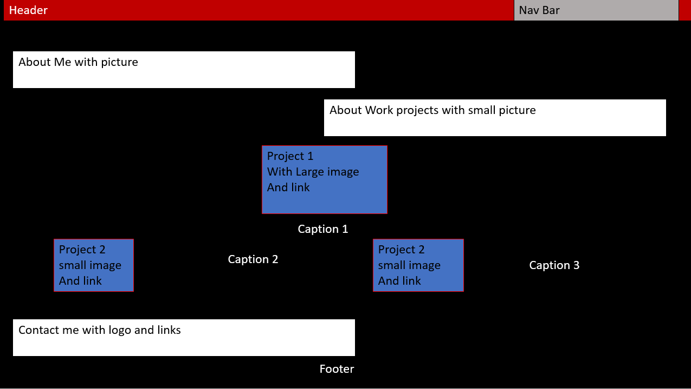

# week-2-challenge

## User Story
 

AS AN employer
I WANT to view potential employee's developed portfolio of work samples
SO THAT I can review samples of their work and assess whether they're a good candidate for an open position

# Acceptance Criteria

GIVEN I need to sample a potential employee's previous work
 

<ul>
<li>WHEN I load their portfolio</li>
<li>THEN I am presented with the developer's name, a recent photo or avatar, and links to sections about them, their work, and how to contact them</li>
<li>WHEN I click one of the links in the navigation</li>
<li>THEN the UI scrolls to the corresponding section</li>
<li>WHEN I click on the link to the section about their work</li>
<li>THEN the UI scrolls to a section with titled images of the developer's applications</li>
<li>WHEN I am presented with the developer's first application</li>
<li>THEN that application's image should be larger in size than the others</li>
<li>WHEN I click on the images of the applications</li>
<li>THEN I am taken to that deployed application</li>
<li>WHEN I resize the page or view the site on various screens and devices</li>
<li>THEN I am presented with a responsive layout that adapts to my viewport</li>
</ul>

[Deployed Site](https://levimendyk.github.io/week-2-challenge/)

Contribution guidelines for this project

